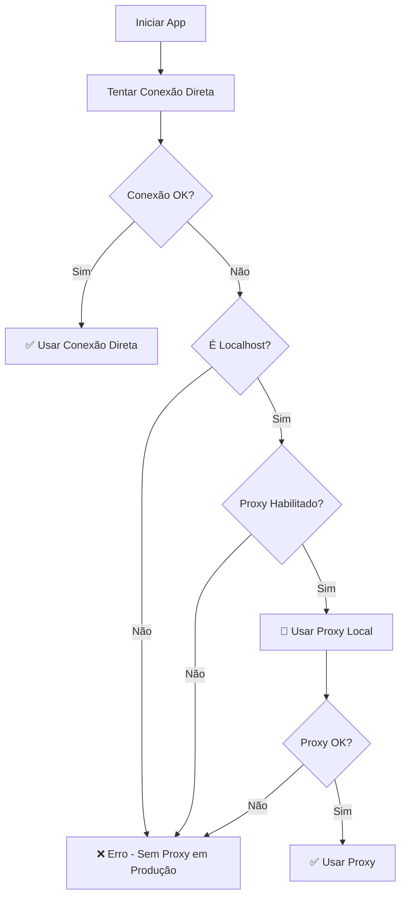

# 🚀 Guia de Deploy - TrackDoc

## 📋 **Resumo de Compatibilidade**

O TrackDoc foi projetado para funcionar em **qualquer ambiente**:

- ✅ **Desenvolvimento local** (com ou sem proxy)
- ✅ **Produção** (Vercel, Netlify, AWS, etc.)
- ✅ **Redes corporativas** (com proxy/firewall)
- ✅ **Redes normais** (conexão direta)

## 🔧 **Como Funciona a Detecção Automática**

### 1. **Tentativa de Conexão Direta** (Sempre primeiro)
```javascript
// Tenta conectar diretamente ao Supabase
const directClient = createBrowserClient(supabaseUrl, supabaseAnonKey)
await directClient.auth.getSession() // Teste com timeout de 5s
```

### 2. **Fallback para Proxy** (Apenas se necessário)
```javascript
// Só usa proxy se:
// - Estiver em localhost/127.0.0.1 E
// - NEXT_PUBLIC_ENABLE_PROXY = 'auto' ou 'true'
const shouldUseProxy = isLocalDevelopment && enableProxy
```

## 🌍 **Configuração por Ambiente**

### **Desenvolvimento Local (Sem Proxy)**
```env
NEXT_PUBLIC_SUPABASE_URL=https://seu-projeto.supabase.co
NEXT_PUBLIC_SUPABASE_ANON_KEY=sua-chave
SUPABASE_SERVICE_ROLE_KEY=sua-chave-service
NEXT_PUBLIC_ENABLE_PROXY=false
```

### **Desenvolvimento Local (Com Proxy Corporativo)**
```env
NEXT_PUBLIC_SUPABASE_URL=https://seu-projeto.supabase.co
NEXT_PUBLIC_SUPABASE_ANON_KEY=sua-chave
SUPABASE_SERVICE_ROLE_KEY=sua-chave-service
NEXT_PUBLIC_ENABLE_PROXY=auto  # Detecta automaticamente
```

### **Produção (Vercel, Netlify, etc.)**
```env
NEXT_PUBLIC_SUPABASE_URL=https://seu-projeto.supabase.co
NEXT_PUBLIC_SUPABASE_ANON_KEY=sua-chave
SUPABASE_SERVICE_ROLE_KEY=sua-chave-service
NEXT_PUBLIC_ENABLE_PROXY=false  # Sempre false em produção
NODE_ENV=production
```

## 🔍 **Detecção de Ambiente**

O sistema detecta automaticamente:

```javascript
// Desenvolvimento local
const isLocalDevelopment = 
  window.location.hostname === 'localhost' || 
  window.location.hostname === '127.0.0.1'

// Produção
const isProduction = process.env.NODE_ENV === 'production'
```

## 📊 **Fluxo de Decisão**



## 🚀 **Deploy em Diferentes Plataformas**

### **Vercel**
1. Conecte seu repositório
2. Configure as variáveis de ambiente:
   ```
   NEXT_PUBLIC_SUPABASE_URL=...
   NEXT_PUBLIC_SUPABASE_ANON_KEY=...
   SUPABASE_SERVICE_ROLE_KEY=...
   NEXT_PUBLIC_ENABLE_PROXY=false
   ```
3. Deploy automático ✅

### **Netlify**
1. Conecte seu repositório
2. Build command: `npm run build`
3. Publish directory: `.next`
4. Configure environment variables ✅

### **AWS Amplify**
1. Conecte seu repositório
2. Configure build settings
3. Adicione variáveis de ambiente ✅

### **Docker**
```dockerfile
FROM node:18-alpine
WORKDIR /app
COPY package*.json ./
RUN npm ci --only=production
COPY . .
ENV NEXT_PUBLIC_ENABLE_PROXY=false
ENV NODE_ENV=production
RUN npm run build
EXPOSE 3000
CMD ["npm", "start"]
```

## ⚠️ **Importante para Produção**

### **Sempre definir:**
```env
NEXT_PUBLIC_ENABLE_PROXY=false
NODE_ENV=production
```

### **Nunca em produção:**
- Proxy local (só funciona em localhost)
- Variáveis de desenvolvimento
- Logs de debug do proxy

## 🧪 **Testando Diferentes Cenários**

### **Teste 1: Rede Normal**
```bash
# .env.local
NEXT_PUBLIC_ENABLE_PROXY=false
npm run dev
# ✅ Deve usar conexão direta
```

### **Teste 2: Rede com Proxy**
```bash
# .env.local  
NEXT_PUBLIC_ENABLE_PROXY=auto
npm run dev
# 🔄 Deve detectar e usar proxy se necessário
```

### **Teste 3: Produção**
```bash
# .env.production
NEXT_PUBLIC_ENABLE_PROXY=false
NODE_ENV=production
npm run build && npm start
# ✅ Deve usar apenas conexão direta
```

## 📈 **Monitoramento**

### **Logs de Conexão**
```javascript
// Desenvolvimento
console.log('🔄 Testando conexão direta...')
console.log('✅ Conexão direta funcionando')
console.log('🔄 Proxy fetch (dev only):', url)

// Produção
// Logs minimizados automaticamente
```

### **Indicadores Visuais**
- **✅ Conexão Direta** (verde)
- **🔄 Proxy Ativo** (laranja) - apenas desenvolvimento
- **❌ Sem Conexão** (vermelho)

## 🔧 **Troubleshooting**

### **Problema: Proxy em Produção**
```
Erro: "proxy não está disponível em produção"
```
**Solução:** Definir `NEXT_PUBLIC_ENABLE_PROXY=false`

### **Problema: Conexão Lenta**
```
Timeout na conexão direta
```
**Solução:** Verificar firewall/proxy corporativo

### **Problema: Build Falha**
```
Erro de variáveis de ambiente
```
**Solução:** Verificar todas as variáveis necessárias

## ✅ **Checklist de Deploy**

- [ ] Variáveis de ambiente configuradas
- [ ] `NEXT_PUBLIC_ENABLE_PROXY=false` em produção
- [ ] `NODE_ENV=production` definido
- [ ] Build local testado: `npm run build`
- [ ] Conexão direta testada
- [ ] URLs de produção corretas

## 🎯 **Resultado Final**

O sistema é **100% compatível** com qualquer ambiente:
- **Desenvolvimento:** Detecta automaticamente se precisa de proxy
- **Produção:** Sempre usa conexão direta (mais rápida e segura)
- **Flexível:** Pode ser configurado manualmente se necessário