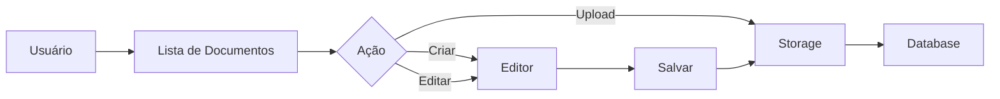

# Funcionalidade Office - Editor de Documentos Word

## 📋 Visão Geral

A funcionalidade **Office** permite que usuários criem e editem documentos Word diretamente na plataforma TrackDoc, sem necessidade de software externo como Microsoft Word ou LibreOffice.

## ✨ Características Principais

### 1. Criação de Documentos
- Criar documentos Word do zero
- Editor WYSIWYG completo
- Formatação profissional

### 2. Upload de Documentos
- Suporte para .doc, .docx e .odt
- Validação automática de tipo
- Armazenamento seguro

### 3. Edição Online
- Editor completo no navegador
- Formatação de texto (negrito, itálico, sublinhado)
- Fontes e tamanhos personalizados
- Cores e destaques
- Listas numeradas e com marcadores
- Tabelas
- Imagens
- Cabeçalhos e rodapés

### 4. Gerenciamento
- Lista de todos os documentos
- Busca por nome
- Download de documentos
- Exclusão de documentos
- Visualização de datas

## 🎯 Casos de Uso

### Empresarial
- Criar contratos e propostas
- Editar políticas internas
- Redigir relatórios
- Criar documentos colaborativos

### Educacional
- Criar materiais didáticos
- Editar trabalhos acadêmicos
- Preparar apresentações escritas

### Pessoal
- Criar currículos
- Editar cartas
- Redigir documentos pessoais

## 🏗️ Arquitetura Técnica

### Stack Tecnológico
- **Frontend:** React + Next.js
- **Editor:** OnlyOffice Document Server
- **Storage:** Supabase Storage
- **Database:** PostgreSQL (Supabase)
- **Autenticação:** Supabase Auth

### Componentes

```
app/
├── office/
│   ├── page.tsx              # Página principal
│   └── README.md             # Documentação
├── components/
│   └── document-editor.tsx   # Componente do editor
└── page.tsx                  # Integração com menu
```

### Fluxo de Dados



## 🔒 Segurança

### Autenticação
- Login obrigatório
- Sessão validada em cada operação
- Token JWT para API

### Autorização
- Row Level Security (RLS) no Supabase
- Usuários só acessam seus próprios documentos
- Isolamento por entity_id

### Storage
- Arquivos armazenados com path único
- Estrutura: `{user_id}/{timestamp}_{filename}`
- URLs assinadas para download

### Validações
- Tipo de arquivo validado no upload
- Tamanho máximo: 50MB
- Sanitização de nomes de arquivo

## 📊 Banco de Dados

### Tabela: office_documents

```sql
CREATE TABLE office_documents (
  id UUID PRIMARY KEY,
  user_id UUID NOT NULL,
  entity_id UUID,
  title TEXT NOT NULL,
  file_path TEXT NOT NULL,
  file_type TEXT NOT NULL,
  file_size BIGINT,
  created_at TIMESTAMPTZ,
  updated_at TIMESTAMPTZ
);
```

### Índices
- `idx_office_documents_user_id`
- `idx_office_documents_entity_id`
- `idx_office_documents_created_at`
- `idx_office_documents_updated_at`

### Políticas RLS
- SELECT: Apenas documentos próprios
- INSERT: Apenas com user_id próprio
- UPDATE: Apenas documentos próprios
- DELETE: Apenas documentos próprios

## 🚀 Instalação e Configuração

### Pré-requisitos
- Node.js 18+
- Docker (para OnlyOffice)
- Conta Supabase

### Instalação Rápida

#### Windows
```bash
scripts\setup-onlyoffice.bat
```

#### Linux/Mac
```bash
chmod +x scripts/setup-onlyoffice.sh
./scripts/setup-onlyoffice.sh
```

### Instalação Manual

1. **Instalar dependências**
```bash
npm install @onlyoffice/document-editor-react
```

2. **Configurar OnlyOffice**
```bash
docker run -i -t -d -p 80:80 \
  -e JWT_ENABLED=false \
  onlyoffice/documentserver
```

3. **Configurar variáveis de ambiente**
```env
NEXT_PUBLIC_ONLYOFFICE_URL=http://localhost
```

4. **Executar migração do banco**
```bash
# Aplicar migration no Supabase
supabase/migrations/create_office_documents_table.sql
```

5. **Reiniciar aplicação**
```bash
npm run dev
```

## 📖 Documentação

### Para Usuários
- [Guia Rápido](./OFFICE_QUICK_START.md) - Como usar a funcionalidade
- [FAQ](./OFFICE_FAQ.md) - Perguntas frequentes

### Para Desenvolvedores
- [Setup OnlyOffice](./ONLYOFFICE_SETUP.md) - Configuração detalhada
- [README Office](../app/office/README.md) - Documentação técnica
- [API Reference](./OFFICE_API.md) - Endpoints e métodos

## 🔧 Configuração Avançada

### Produção

#### Habilitar JWT
```bash
docker run -i -t -d -p 80:80 \
  -e JWT_ENABLED=true \
  -e JWT_SECRET=your_secret_key \
  onlyoffice/documentserver
```

#### HTTPS
Configure um proxy reverso (Nginx/Apache) com SSL.

#### Escalabilidade
Use OnlyOffice Cloud ou configure cluster.

### Customização

#### Temas
Personalize cores e estilos no editor.

#### Idioma
Configure idioma padrão no editor.

#### Permissões
Ajuste permissões de edição por usuário.

## 📈 Métricas e Monitoramento

### KPIs
- Documentos criados por dia
- Documentos editados por usuário
- Tempo médio de edição
- Taxa de upload vs criação

### Logs
- Ações de usuário
- Erros de upload
- Falhas de salvamento
- Performance do editor

## 🐛 Troubleshooting

### Problemas Comuns

#### Editor não carrega
1. Verificar se OnlyOffice está rodando
2. Verificar variável de ambiente
3. Verificar console do navegador

#### Upload falha
1. Verificar tamanho do arquivo
2. Verificar tipo de arquivo
3. Verificar permissões do bucket

#### Documento não salva
1. Verificar conexão com Supabase
2. Verificar políticas RLS
3. Verificar logs do navegador

### Logs Úteis

```bash
# Logs do OnlyOffice
docker logs onlyoffice-documentserver

# Logs do container
docker logs -f onlyoffice-documentserver

# Status do container
docker ps | grep onlyoffice
```

## 🔄 Roadmap

### Versão 1.1 (Próxima)
- [ ] Colaboração em tempo real
- [ ] Comentários e revisões
- [ ] Versionamento de documentos
- [ ] Templates pré-definidos

### Versão 1.2
- [ ] Exportação para PDF
- [ ] Integração com assinatura eletrônica
- [ ] Compartilhamento de documentos
- [ ] Histórico de alterações

### Versão 2.0
- [ ] Suporte a Excel
- [ ] Suporte a PowerPoint
- [ ] OCR para documentos escaneados
- [ ] IA para sugestões de texto

## 🤝 Contribuindo

Para contribuir com melhorias:
1. Crie uma branch: `git checkout -b feature/nova-funcionalidade`
2. Faça suas alterações
3. Teste localmente
4. Envie um PR

## 📞 Suporte

### Canais de Suporte
- Email: suporte@trackdoc.com.br
- Chat: Disponível na plataforma
- Documentação: docs.trackdoc.com.br

### Reportar Bugs
Use o sistema de issues do GitHub com:
- Descrição do problema
- Passos para reproduzir
- Screenshots (se aplicável)
- Logs relevantes

## 📄 Licença

Esta funcionalidade faz parte do TrackDoc e está sujeita aos termos de uso da plataforma.

## 🙏 Agradecimentos

- OnlyOffice pela excelente solução open-source
- Supabase pela infraestrutura
- Comunidade Next.js

---

**Última atualização:** Janeiro 2026
**Versão:** 1.0.0
